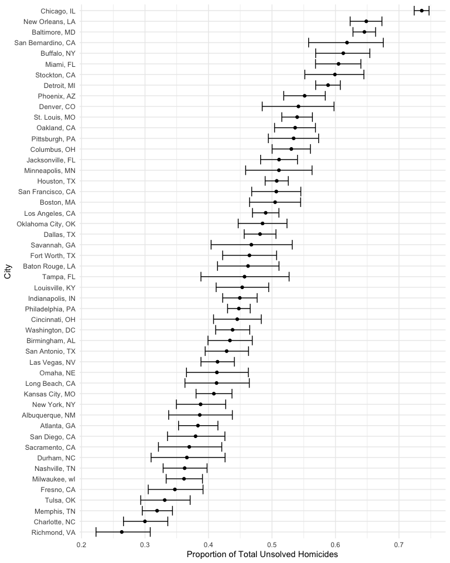
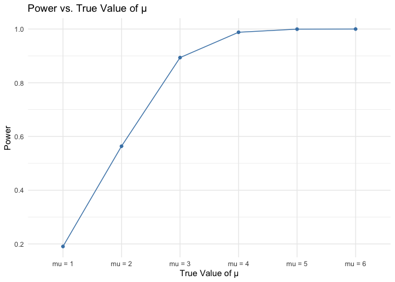

p8105_hw5_jy3360
================
Candice Yu
2023-11-07

# Problem 1

Describe the raw data. Create a city_state variable (e.g. “Baltimore,
MD”) and then summarize within cities to obtain the total number of
homicides and the number of unsolved homicides (those for which the
disposition is “Closed without arrest” or “Open/No arrest”).

``` r
# load the data
homicide_data <- read_csv("homicide-data.csv")
```

    ## Rows: 52179 Columns: 12
    ## ── Column specification ────────────────────────────────────────────────────────
    ## Delimiter: ","
    ## chr (9): uid, victim_last, victim_first, victim_race, victim_age, victim_sex...
    ## dbl (3): reported_date, lat, lon
    ## 
    ## ℹ Use `spec()` to retrieve the full column specification for this data.
    ## ℹ Specify the column types or set `show_col_types = FALSE` to quiet this message.

The raw data includes 52179 observations and 12 variables.

``` r
# create city_state variable and summarize within cities
homicides_summary <- 
  homicide_data %>%
  mutate(city_state = paste(city, state, sep = ", ")) %>%
  group_by(city_state) %>%
  summarise(
    total_homicides = n(),
    total_unsolved_homicides = sum(disposition %in% c("Closed without arrest", 
                                                      "Open/No arrest"))
  ) %>%
  filter(total_unsolved_homicides != 0)

homicides_summary
```

    ## # A tibble: 50 × 3
    ##    city_state      total_homicides total_unsolved_homicides
    ##    <chr>                     <int>                    <int>
    ##  1 Albuquerque, NM             378                      146
    ##  2 Atlanta, GA                 973                      373
    ##  3 Baltimore, MD              2827                     1825
    ##  4 Baton Rouge, LA             424                      196
    ##  5 Birmingham, AL              800                      347
    ##  6 Boston, MA                  614                      310
    ##  7 Buffalo, NY                 521                      319
    ##  8 Charlotte, NC               687                      206
    ##  9 Chicago, IL                5535                     4073
    ## 10 Cincinnati, OH              694                      309
    ## # ℹ 40 more rows

For the city of Baltimore, MD, use the prop.test function to estimate
the proportion of homicides that are unsolved; save the output of
prop.test as an R object, apply the broom::tidy to this object and pull
the estimated proportion and confidence intervals from the resulting
tidy dataframe.

``` r
# Estimate the proportion for Baltimore, MD
baltimore_data <-
  homicides_summary %>%
  filter(city_state == "Baltimore, MD") 

baltimore_unsolved <- pull(baltimore_data, total_unsolved_homicides)
baltimore_total <- pull(baltimore_data, total_homicides)

baltimore_test <- prop.test(baltimore_unsolved, baltimore_total)

broom::tidy(baltimore_test) %>%
  select(estimate, conf.low, conf.high)
```

    ## # A tibble: 1 × 3
    ##   estimate conf.low conf.high
    ##      <dbl>    <dbl>     <dbl>
    ## 1    0.646    0.628     0.663

Now run `prop.test` for each of the cities in your dataset, and extract
both the proportion of unsolved homicides and the confidence interval
for each. Do this within a “tidy” pipeline, making use of purrr::map,
purrr::map2, list columns and unnest as necessary to create a tidy
dataframe with estimated proportions and CIs for each city.

``` r
# running prop.test for each city and creating a tidy dataframe
city_estimates <- homicides_summary %>%
  group_by(city_state) %>%
  summarize(
    prop_test = list(prop.test(total_unsolved_homicides, total_homicides))
  ) %>% 
  mutate(tidy_test = purrr::map(prop_test, broom::tidy)) %>%
  select(-prop_test) %>%
  unnest(tidy_test) %>%
  select(city_state, estimate, conf.low, conf.high) 
```

Create a plot that shows the estimates and CIs for each city – check out
geom_errorbar for a way to add error bars based on the upper and lower
limits. Organize cities according to the proportion of unsolved
homicides.

``` r
# plotting the estimates with CIs for each city
ggplot(city_estimates, aes(x = reorder(city_state, estimate), y = estimate)) +
  geom_point() +
  geom_errorbar(aes(ymin = conf.low, ymax = conf.high)) +
  coord_flip() +
  labs(x = "City", y = "Proportion of Total Unsolved Homicides")
```

<!-- -->

# Problem 2

Create a tidy dataframe containing data from all participants, including
the subject ID, arm, and observations over time:

- Start with a dataframe containing all file names; the list.files
  function will help
- Iterate over file names and read in data for each subject using
  purrr::map and saving the result as a new variable in the dataframe
- Tidy the result; manipulate file names to include control arm and
  subject ID, make sure weekly observations are “tidy”, and do any other
  tidying that’s necessary

``` r
# dataframe with file names
files_df <- tibble(file_name = list.files(path = "./data", full.names = TRUE)) 

# iterate over file names and tidy the result
tidy_data <- files_df %>%
  mutate(data = purrr::map(file_name, ~ read_csv(.x, show_col_types = FALSE))) %>%  # iterate over file names and read in data
  mutate(       # extract subject IDs and arms from file names
    subject_id = as.numeric(str_extract(file_name, "[0-9]{2}")),   # extract all the 2-digits number 
    arm = if_else(str_detect(file_name, "/con_"), "control", "experimental")   # assign arms 
  ) %>%
  select(subject_id, arm, data) %>%   # deselect the file_name
  unnest(data) %>%              # tidy the result
  pivot_longer(cols = starts_with("week"), 
               names_prefix = "week_",
               names_to = "week", 
               values_to = "observation") %>%
  mutate(week = as.numeric(week),
         subject_id = as.factor(subject_id))
```

Make a spaghetti plot showing observations on each subject over time,
and comment on differences between groups.

``` r
ggplot(tidy_data, aes(x = week, y = observation, group = subject_id, color = subject_id)) +
  geom_line() +
  geom_point() +
  labs(title = "Observations over Time by Subject", x = "Time (Weeks)", y = "Observation") +
  facet_grid(~ arm)
```

<!-- -->
Comment:

- The observations of the experimental group are generally higher than
  that the control group.
- We can also see that the observations of experimental group has an
  increasing trend over time, but the observations of control group
  remain relatively stable over time.

# Problem 3

First set the following design elements:

- Fix n = 30
- Fix $\sigma$ = 5
- Set $\mu$ = 0. Generate 5000 datasets from the model:
  $x ∼ Normal [\mu, \sigma]$
- For each dataset, save $\hat{\mu}$ and the p-value arising from a test
  of H: $\mu$ = 0 using $\alpha$ = 0.05

Hint: to obtain the estimate and p-value, use broom::tidy to clean the
output of t.test.

``` r
# define parameters
n_simulations <- 5000
n <- 30
sigma <- 5
mu <- 0
alpha <- 0.05

# define the simulation function
simulate_t_test <- function(mu, n, sigma) {
  sample <- rnorm(n, mean = mu, sd = sigma)
  test_result <- t.test(sample, mu = mu)
  tidy_result <- broom::tidy(test_result)
  return(tidy_result[c("estimate", "p.value")])
}

# Run the simulation 5000 times for mu = 0
simulation_results <- map_dfr(1:n_simulations, ~simulate_t_test(mu, n, sigma))

# Review the structure of the first few results
head(simulation_results)
```

    ## # A tibble: 6 × 2
    ##   estimate p.value
    ##      <dbl>   <dbl>
    ## 1   -0.752  0.389 
    ## 2   -1.63   0.0781
    ## 3    0.502  0.613 
    ## 4    0.816  0.477 
    ## 5    0.289  0.766 
    ## 6   -0.398  0.649

Repeat the above for $\mu$ = {1,2,3,4,5,6}, and complete the following:

- Make a plot showing the proportion of times the null was rejected (the
  power of the test) on the y axis and the true value of $\mu$ on the x
  axis. Describe the association between effect size and power.
- Make a plot showing the average estimate of $\hat{\mu}$ on the y axis
  and the true value of $\mu$ on the x axis.
- Make a second plot (or overlay on the first) the average estimate of
  $\hat{\mu}$ only in samples for which the null was rejected on the y
  axis and the true value of $\mu$ on the x axis.
- Is the sample average of $\hat{\mu}$ across tests for which the null
  is rejected approximately equal to the true value of $\mu$? Why or why
  not?

``` r
# create a list with 6 different sample size 
mu_list =
  list(
    "mu = 1" = 1,
    "mu = 2" = 2,
    "mu = 3" = 3,
    "mu = 4" = 4,
    "mu = 5" = 5,
    "mu = 6" = 6
  )

# run the simulation for each value of mu
results <- map_df(mu_list, function(mu) {
  map_dfr(1:n_simulations, ~simulate_t_test(mu, n, sigma))
}, .id = "mu")

# convert the mu to a numeric value for plotting
results %>%
  mutate(mu = as.numeric(str_extract(results$mu, "\\d+")))
```

    ## # A tibble: 30,000 × 3
    ##       mu estimate p.value
    ##    <dbl>    <dbl>   <dbl>
    ##  1     1   1.66     0.404
    ##  2     1  -0.0640   0.186
    ##  3     1   0.678    0.733
    ##  4     1   0.938    0.934
    ##  5     1   1.50     0.503
    ##  6     1   1.48     0.632
    ##  7     1   1.96     0.280
    ##  8     1   0.659    0.618
    ##  9     1   0.155    0.295
    ## 10     1   1.42     0.694
    ## # ℹ 29,990 more rows

``` r
# calculate the power for each mu
power_results <- results %>%
  group_by(mu) %>%
  summarise(
    power = mean(p.value < alpha),
    mean_estimate = mean(estimate),
    mean_estimate_rejected = mean(estimate[p.value < alpha])
  ) %>%
  ungroup()


# plotting
power_results %>%
  ggplot(aes(x = mu, y = power)) +
  geom_point() +
  geom_line() +
  theme_minimal() +
  labs(title = "Power vs. True Value of µ", x = "True Value of µ", y = "Power")
```

    ## `geom_line()`: Each group consists of only one observation.
    ## ℹ Do you need to adjust the group aesthetic?

<!-- -->

``` r
power_results %>%
  ggplot(aes(x = mu)) +
  geom_point(aes(y = mean_estimate), color = "blue") +
  geom_line(aes(y = mean_estimate), color = "blue") +
  geom_point(aes(y = mean_estimate_rejected), color = "red") +
  geom_line(aes(y = mean_estimate_rejected), color = "red") +
  theme_minimal() +
  labs(title = "Mean Estimate of µ vs. True Value of µ", x = "True Value of µ", y = "Mean Estimate of µ") +
  scale_color_manual("", labels = c("All Tests", "Rejected Tests"), values = c("blue", "red"))
```

    ## `geom_line()`: Each group consists of only one observation.
    ## ℹ Do you need to adjust the group aesthetic?
    ## `geom_line()`: Each group consists of only one observation.
    ## ℹ Do you need to adjust the group aesthetic?

<!-- -->
